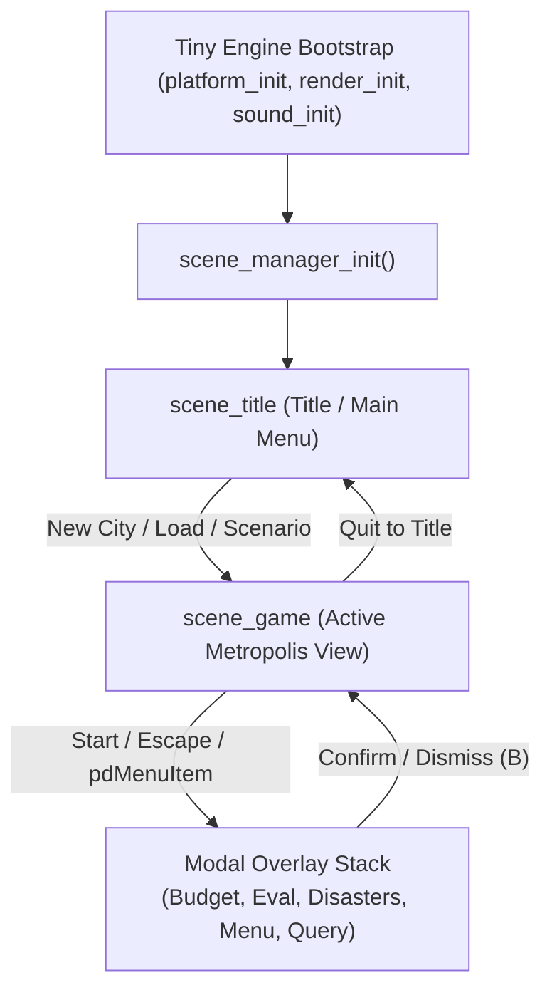

# Micropolis (SimCity Classic) Port to Tiny Engine

## 1. Project Overview

This project ports **Micropolis** (the open-source release of Will Wright's classic **SimCity**, originally developed by Maxis and released under the GNU General Public License v3 by Electronic Arts / Don Hopkins) to **Tiny Engine**. The port targets both **Desktop / SDL2 (800x480 native, 400x240 virtual canvas)** and the **Panic Playdate (400x240 1-bit monochrome, ARM Cortex-M7)**.

The port uses the streamlined Unix C codebase from [`reference/vtcity`](file:///home/iceman/Developer/games/tiny/projects/micropolis/reference/vtcity/) as its starting baseline. `vtcity` previously stripped out the heavy legacy X11, Tcl/Tk, and NeWS dependencies, replacing custom memory allocators with standard libc `malloc/free` and isolating the core simulation engine.

### Porting Philosophy & Objectives

1. **Simulation Integrity**: Retain the complete, authentic cellular automata simulation engine — zoning logic, power grid propagation, traffic routing, dynamic budgeting, disasters, sprite animations, census data histories, procedural terrain generation, and city evaluation algorithms.
2. **Terminal Code Decoupling**: Completely strip out the DEC VT terminal front-end (`vt_term.c`, `vt_render.c`, `vt_menu.c`, `vt_status.c`, `vt_minimap.c`, `vt_dialogs.c`, DRCS soft-font downloads, and terminal escape sequence drivers), replacing them with clean stubs and engine hooks.
3. **PNG-Based Graphical Pipeline**: Render all graphics using **PNG textures and sprite atlases** rather than terminal character glyphs. Render the city using 16x16 pixel tiles (extracted from `tilesbw.png` or color asset packs) and animated sprite sheets.
4. **C99 Standard Modernization**: Transition the entire codebase from 1980s K&R / GNU C89 syntax to clean, standard C99 (`-std=c99`) with zero compilation warnings, explicit return types, strict function prototypes, and standard integer typing.
5. **Tiny Engine Architecture**: Adapt the game into a non-blocking, fixed-timestep `scene_t` architecture, integrating with Tiny Engine's unified input subsystem, audio playback pipeline (`sound.h`), and cross-platform persistent storage.

---

## 2. Phase 1: Engine Isolation, Source Tree & C99 Compliance

Phase 1 focuses on extracting the core simulation logic, removing terminal rendering code, providing placeholder UI and renderer stubs, and achieving a clean C99 build on both desktop and Playdate toolchains.

### Immediate Action Items

- [x] **Source Tree Organization**:
  - Create directory `src/micropolis/` to house the ported game core.
  - Copy all engine and logic source files from [`reference/vtcity/src/`](file:///home/iceman/Developer/games/tiny/projects/micropolis/reference/vtcity/src/):
    - **Simulation Core**: `s_alloc.c`, `s_disast.c`, `s_eval.c`, `s_fileio.c`, `s_gen.c`, `s_init.c`, `s_msg.c`, `s_power.c`, `s_scan.c`, `s_sim.c`, `s_traf.c`, `s_zone.c`.
    - **Tools & Entities**: `g_ani.c`, `w_con.c`, `w_tool.c`, `w_sprite.c`, `w_budget.c`, `w_eval.c`, `w_keys.c`, `w_resrc.c`, `w_update.c`, `w_util.c`, `w_sound.c`, `rand.c`, `random.c`.
    - **Headers**: `sim.h`, `view.h`, `mac.h`, `macros.h`, `animtab.h`, `res_data.h`.
  - Exclude all VT terminal front-end files (`vt_main.c`, `vt_term.c`, `vt_render.c`, `vt_input.c`, `vt_status.c`, `vt_minimap.c`, `vt_menu.c`, `vt_dialogs.c`, `vt_stubs.c`, `vt.h`, `vt_tiles.h`, `mktileset.c`).

- [x] **Decoupling Rendering & UI Callbacks (Stubs)**:
  - Create `src/micropolis/sim_stubs.c` providing clean stub implementations for simulation UI callbacks and discarded subsystems:
    - View invalidation and redraws (`EventuallyRedrawView`, `InvalidateMaps`, `InvalidateEditors`, `RedrawMaps`, `RedrawEditors`, `DoUpdateEditor`, `DoUpdateMap`).
    - UI events and notifications (`sim_ui_auto_goto`, `sim_ui_show_notice`, `sim_ui_show_zone_status`, `sim_ui_did_tool`, `sim_ui_budget_modal`).
    - Discarded legacy overlay/chalk ink routines (`StartInk`, `AddInk`, `FreeInk`, `NewInk`, `EraseOverlay`).
    - Graphs and census stubs (`drawGraph`, `initGraphs`, `doAllGraphs`).
    - Sound stubs (`MakeSound`, `MakeSoundOn`, `InitializeSound`, `StopSound`).
  - Decouple `w_tool.c`, `s_msg.c`, and `w_budget.c` from `vt_*` functions by replacing them with abstract engine callback hooks.

- [x] **C99 Standard Compliance Refactoring**:
  - **Implicit-Int Returns**: Convert all K&R implicit-int function declarations to explicit return types (`void`, `int`, `short`, etc.).
  - **K&R Parameter Declarations**: Modernize all old-style function definitions (`foo(x, y) int x; int y; { ... }`) to ANSI/C99 prototypes (`int foo(int x, int y) { ... }`).
  - **Register Variables**: Replace untyped `register xx, yy, zz;` declarations with explicit types (`int xx, yy, zz;`).
  - **Function Prototypes**: Add complete forward declarations to [`headers/sim.h`](file:///home/iceman/Developer/games/tiny/projects/micropolis/reference/vtcity/src/headers/sim.h) and [`headers/view.h`](file:///home/iceman/Developer/games/tiny/projects/micropolis/reference/vtcity/src/headers/view.h) to eliminate `-Wimplicit-function-declaration`.
  - **Non-Void Return Consistency**: Ensure all functions declared with a non-void return type return an explicit value, resolving `-Wreturn-mismatch`.
  - **Integer Types**: Verify that `QUAD` is consistently defined as a 32-bit signed integer (`int32_t` via `<stdint.h>`) across both 32-bit (Playdate ARM Cortex-M7) and 64-bit desktop hosts.

- [x] **Build Integration**:
  - Update [`meson.build`](file:///home/iceman/Developer/games/tiny/projects/micropolis/meson.build):
    - Define `micropolis_sources` and compile static library `libmicropolis.a` with `-std=c99`.
    - Link `micropolis` executable against `libmicropolis.a` and `engine_lib`.
  - Update [`CMakeLists.txt`](file:///home/iceman/Developer/games/tiny/projects/micropolis/CMakeLists.txt):
    - Add micropolis sources and include directories to Playdate simulator and device build targets.
  - Verify clean compilation with zero errors on all toolchains (Desktop Meson/Ninja, Playdate Simulator pdc, Playdate ARM Device pdc).

---

## 3. Enumeration of Tasks to be Done

### Phase 2: Video & Graphics Pipeline (PNG & Sprite Architecture)

- [x] **Task 2.1: Tile Atlas & Asset Pipeline**
  - Implemented [`tools/extract_tiles.py`](file:///home/iceman/Developer/games/tiny/projects/micropolis/tools/extract_tiles.py) extracting all 969 tiles and sprites into [`assets/gfx/tiles_16.png`](file:///home/iceman/Developer/games/tiny/projects/micropolis/assets/gfx/tiles_16.png) (512x512 master atlas) and [`assets/gfx/sprites_16.png`](file:///home/iceman/Developer/games/tiny/projects/micropolis/assets/gfx/sprites_16.png).
  - Created [`assets/gfx/tileset.json`](file:///home/iceman/Developer/games/tiny/projects/micropolis/assets/gfx/tileset.json) and [`headers/tileset_atlas.h`](file:///home/iceman/Developer/games/tiny/projects/micropolis/src/micropolis/headers/tileset_atlas.h).
  - Animated tile cycles (`animateTiles()`) driven by fixed-interval timer.

- [x] **Task 2.2: Map Viewport & Tile Blitter (`sim_render.c`)**
  - Implemented camera viewport scrolling and frustum culling over 120x100 tile grid.
  - Decoded tile indices (`LOMASK`) and flag bits (`PWRBIT`, `ZONEBIT`, `BULLBIT`, `BURNBIT`).
  - Implemented flashing unpowered indicator (tile 827) on unpowered zones.

- [x] **Task 2.3: Sprite Rendering Layer**
  - Implemented dynamic sprite renderer for Train, Helicopter, Airplane, Ship, Monster, Tornado, and Explosions in [`sim_render.c`](file:///home/iceman/Developer/games/tiny/projects/micropolis/src/sim_render.c).

- [x] **Task 2.4: Map Overlays & Minimap**
  - Implemented overlays: Power grid (`PowerMap`), Traffic density (`TDMAP`), Pollution (`PLMAP`), Crime rate (`CRMAP`), Land value (`LVMAP`).
  - Implemented 60x50 color-coded minimap radar with visible camera viewport rectangle.

- [x] **Task 2.5: HUD, Demand Gauges & Tool Palette**
  - Top status bar rendering City Name, Date, Funds, Population, Tool Name, and Overlay indicator.
  - R/C/I Demand Valves (Residential, Commercial, Industrial) meters.
  - Visual tool palette with tool icons and costs.

---

### Phase 3: Input Subsystem & Controls Wiring

- [x] **Task 3.1: Dual-Source Input Architecture (`src/sim_input.h` / `src/sim_input.c`)**
  - Replace disconnected virtual action bindings with a unified cross-platform input manager:
    - **Engine / Playdate Polling**: Reads Tiny Engine's `platform_get_input()` (`held[]`, `pressed[]`, `released[]`, `crank_change`, `mouse_pos`, `mouse_down`).
    - **Desktop SDL2 Polling** (`#if !defined(PLAYDATE)`): Direct `SDL_GetKeyboardState()` and `SDL_GetMouseState()` with per-frame edge detection (`just_pressed = current && !prev`).
  - Eliminate WASD navigation conflicts: classic SimCity hotkeys `W` (Wire), `S` (Stadium), and `A` (Airport) are fully restored, while grid navigation uses Arrow Keys, Numpad arrows (`KP_8`, `KP_2`, `KP_4`, `KP_6`), and Mouse.

- [x] **Task 3.2: Desktop Keyboard & Mouse Interaction**
  - **Tool Placement & Dragging**: Holding Left Mouse Button or Button A while moving cursor continuously lays Roads, Power Wires, and bulldozes tracts.
  - **Interactive UI Click Targets**:
    - **Bottom Tool Tray**: Clicking any tool icon selects it immediately with audio feedback and toast confirmation.
    - **Minimap Radar**: Clicking anywhere inside the 60x50 minimap instantly centers the camera viewport on that location.
    - **Status Bar & Overlays**: Clicking the overlay badge cycles data layers; clicking funds opens Budget modal.
  - **Right-Click Inspection**: Right-clicking any tile directly queries the zone (`MODE_QUERY`) and displays the zone info card; right-clicking during a modal dismisses it.
  - **Mouse Wheel**: Scrolling wheel up/down cycles through available tools.
  - **Classic SimCity Hotkeys**:
    - Tools: `B` (Bulldozer), `R` (Road), `W` (Wire), `P` (Park), `Z` (Res), `C` (Com), `I` (Ind), `F` (Fire), `O` (Police), `S` (Stadium), `T` (Seaport), `L` (Coal), `N` (Nuclear), `A` (Airport), `Q` (Query).
    - Menus & Modals: `U` (Budget), `V` (Evaluation), `X` (Disasters), `G` (Scenarios), `Tab` (Overlays), `M` (Minimap), `Escape` (System Menu).
    - Speeds: `1` (Pause), `2` (Slow), `3` (Normal), `4` (Fast), `Space` (Toggle Pause).

- [x] **Task 3.3: Playdate & Handheld Gamepad Controls**
  - **D-Pad Navigation**: Smooth cursor motion with hold acceleration (initial 0.22s delay, accelerating to 0.04s repeat) and margin camera auto-scrolling.
  - **Button Controls**:
    - Button A: Tap to place building; Hold + D-Pad for continuous drag building; Confirm in dialogs.
    - Button B: Fast query under cursor in play mode; Cancel / Dismiss in modals.
  - **Crank Tool Selector**: Rotary tool wheel advancing 1 tool every 24 degrees of crank rotation with audio cue and toast.
  - **In-Game System Menu (`MODE_MENU`)**: Accessible via `START` / `Escape` / Playdate Menu, enabling complete handheld navigation of Budget, Evaluation, Disasters, Scenarios, Overlays, and Speed without a physical keyboard.
  - **Playdate System Menu**: Register native items via `pd->system->addMenuItem(...)` for Budget, Evaluation, and Scenarios.

---

### Phase 4: Audio Subsystem Integration

- [x] **Task 4.1: Sound Effects Pipeline (`w_sound.c`)**
  - Created [`tools/convert_audio.py`](file:///home/iceman/Developer/games/tiny/projects/micropolis/tools/convert_audio.py) using `ffmpeg` to standardize 49 Micropolis sound effects into 16-bit 22050 Hz Mono WAVs in `assets/sounds/`.
  - Updated [`tools/copy_assets.sh`](file:///home/iceman/Developer/games/tiny/projects/micropolis/tools/copy_assets.sh) to sync audio to `Source/assets/sounds/` for Playdate `pdc` packaging.
  - Implemented `MakeSound()` and `MakeSoundOn()` in [`w_sound.c`](file:///home/iceman/Developer/games/tiny/projects/micropolis/src/micropolis/w_sound.c) with token parsing and fast sound dispatch via Tiny Engine's `sound_play_sound()`.
  - Integrated construction audio on tool placement (`cb_on_did_tool` in `game.c`) for roads, wires, zones, power plants, and bulldozer.
  - Connected disaster audio (sirens, monster roar, explosions, rumble, fire) to catastrophe events.

- [ ] **Task 4.2: Ambient Audio & Music**
  - Ambient city backdrop loops (birds/wind in rural stages; traffic rumble, city hum, and sirens in metropolises).
  - Optional tracker music playback (`sound_play_music()`) for title, budget, and evaluation screens.

---

### Phase 5: Modern Game Loop, Scene Management & UI System

#### Architecture Blueprint: `reference/vtcity/src/vt_main.c` vs Tiny Engine
In `vtcity`, the terminal engine used a single monolithic loop driven by `engine_init()` and a fixed 50ms tick loop (`SIM_TICK_MS = 50`). We adopt its robust simulation lifecycle as a blueprint, but modernize it into a decoupled **scene stack architecture** fitting Tiny Engine:

- [x] **Task 5.1: Scene Stack Architecture (`scene_title` & `scene_game`)**
  - **`scene_title` (Title & Main Menu)**:
    - Background: Animated city skyline / procedural terrain camera pan.
    - Large high-contrast Micropolis logo banner.
    - Selectable menu options:
      1. **New City**: Difficulty level selection (Easy $20k, Medium $10k, Hard $5k), procedural terrain generation via `GenerateSomeCity(seed)`.
      2. **Load Saved City**: Opens save slot picker (Slots 1–4).
      3. **Play Scenario**: Campaign scenario selector (Dullsville 1900, San Francisco 1906, Hamburg 1944, Bern 1965, Tokyo 1957, Detroit 1972, Boston 2010, Rio 2047).
      4. **Options & Audio**: Sound effects toggle, default simulation speed.
      5. **About / Credits**: Will Wright, Don Hopkins, EA GPL v3 attribution.
    - Full D-Pad, keyboard, and mouse click navigation.
  - **`scene_game` (Metropolis Simulation View)**:
    - Encapsulates active city gameplay, viewport rendering, HUD, tool palette, and modal dialogs.
    - Clean state transition from title screen via `scene_set()`.

- [x] **Task 5.2: Decoupled Modern Simulation Loop**
  - **Display / Rendering Rate (60 Hz)**: Smooth camera interpolation, cursor tracking, sprite animation, and immediate UI responsiveness.
  - **Fixed Simulation Timestep (20 Hz / 50ms Tick)**:
    - Delta-time accumulator running `SimFrame()` and `MoveObjects()` gated by `SimSpeed` (0=Paused, 1=Slow, 2=Normal, 3=Fast).
    - Tile animation cycle (`animateTiles()`) decoupled on a 4 Hz blink timer.
    - Census update (`DoUpdateHeads()`) and city score evaluation (`scoreDoer()`) triggered at simulation milestones.
    - Auto-panning disaster camera (`sim_ui_auto_goto`) smoothly focusing on catastrophic events.

- [x] **Task 5.3: UI Layout & Visual Design (400x240 Native Canvas)**
  - **Top Status Bar (H: 16px, Y: 0–16)**:
    - City Name, Date (`Month Year`), Funds (`$XX,XXX`), Population (`Pop: X`), Speed indicator, and active Map Overlay badge (`[POWER]`, `[TRAFFIC]`, `[POLLUTION]`, `[CRIME]`, `[VALUE]`).
  - **Demand Valves (R/C/I) (24x12px, Top-Left)**:
    - Residential (Green), Commercial (Blue), Industrial (Yellow) positive/negative demand bars.
  - **Bottom Tool Tray (H: 20px, Y: 220–240)**:
    - Centered dock with 15 16x16 tool icons (Road, Wire, Dozer, Res, Com, Ind, Fire, Police, Stadium, Park, Seaport, Coal, Nuke, Airport, Query).
    - Amber selection highlight with cost and tool name readout.
  - **Minimap Radar (60x50px, Top-Right)**:
    - City overview with white camera viewport bounding box. Toggleable via `M` / `Select`.
  - **Modal Dialog Panels (Centered 220–270px wide)**:
    - Zone Query Card (`MODE_QUERY`), Interactive Budget Sheet (`MODE_BUDGET`), City Evaluation Sheet (`MODE_EVAL`), Disasters Menu (`MODE_DISASTERS`), Scenario Selector (`MODE_SCENARIOS`), and Handheld System Menu (`MODE_MENU`).
  - **Playdate 1-Bit Dither Adaptation**:
    - High-contrast monochromatic UI elements, checkered dithered modal backdrops, crisp 1-bit typography using Tiny Engine BMFont.

---

### Phase 6: Filesystem & Save Data

- [x] **Task 6.1: Embedded Data & Scenario Management**
  - Retain embedded scenario files (`snro.111` through `snro.888`) and string tables (`stri.*`) in [`headers/res_data.h`](file:///home/iceman/Developer/games/tiny/projects/micropolis/reference/vtcity/src/headers/res_data.h) to eliminate disk dependency for built-in scenarios.
  - Optimize memory footprint: evaluate lazy loading or asset-streaming on memory-constrained devices.

- [x] **Task 6.2: City Persistence & File I/O (`s_fileio.c`)**
  - Replace low-level POSIX file I/O (`open`, `read`, `write`) with Tiny Engine's cross-platform persistence (`platform_save_data()` and `platform_load_data()`).
  - Maintain binary compatibility with classic SimCity `.cty` format (27,120 bytes):
    - `Map[120][100]` tile array (24,000 bytes).
    - `PowerMap[120][100]` bitfield (1,500 bytes).
    - History arrays (Residential, Commercial, Industrial, Crime, Pollution, Money).
    - Miscellaneous simulation variables (Funds, City Time, Tax Rate, Funding percentages).
  - Implement save slot selection interface with city metadata (Name, Year, Funds, Population).

---

### Phase 7: Playdate Specific Optimization

- [ ] **Task 7.1: 400x240 1-bit Monochrome Adaptation**
  - Fast 1-bit tile blitting: 16x16 1-bit monochrome tiles blitted directly to Playdate frame buffer using word-aligned bitwise operations.
  - High-contrast 1-bit UI fonts and icons tailored for Playdate screen legibility.

- [ ] **Task 7.2: CPU & Memory Budget (ARM Cortex-M7)**
  - Profile `SimFrame()` and `s_scan.c` tile update loops on ARM Cortex-M7:
    - Ensure simulation step takes under 5ms per tick.
    - Leverage spatial dirty flags so only active zones are scanned during light cycles.
  - Ensure total BSS, Data, and Text sections remain well below Playdate's 16MB RAM ceiling.

---

## 4. Verification Plan

| Stage | Command / Verification Method | Expected Result |
|---|---|---|
| **C99 Build** | `meson compile -C build` | Builds `libmicropolis.a` and `micropolis` executable with 0 warnings/errors under `-std=c99` |
| **Playdate Simulator Build** | `cmake -B build-sim && ninja -C build-sim` | Compiles simulator shared library `libmicropolis.so` |
| **Playdate Device Build** | `cmake -B build-pd -DTOOLCHAIN=armgcc && ninja -C build-pd` | Builds ARM Cortex-M7 binary `micropolis_DEVICE.elf` within RAM budget |
| **Simulation Sanity Test** | Run headless simulation step with fixed seed (e.g. 100 frames) | Simulation state, population, and funds update deterministically without crashing |
| **Tile Renderer Check** | Launch desktop target, inspect viewport output | 16x16 PNG tiles correctly rendered and culled across the 120x100 grid |
| **Input Check** | Move cursor via D-pad/keyboard, select tools, place zones | Cursor scrolls viewport, tools debit funds and place proper tile structures |
| **Save/Load Check** | Save city, load saved `.cty` file | Full city layout, funds, and date faithfully restored |
