# Micropolis for Playdate

The classic city simulator, rebuilt for the [Playdate](https://play.date): the full Micropolis (SimCity Classic) simulation with an interface designed around the D-pad, two buttons and the crank.

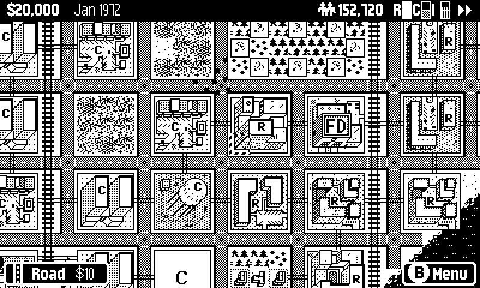

## What it is

[Micropolis](https://github.com/SimHacker/micropolis) is the open-source release of the original SimCity. This project takes [icedman's Tiny Engine port](https://github.com/icedman/tiny_micropolis) of that simulation and gives it a Playdate-native interface:

- **The whole simulation.** Zoning, power grids, traffic, pollution, crime, land value, budgets, disasters, public opinion, and all eight historical scenarios.
- **The map takes up nearly the whole screen.** A slim status bar shows funds, date, population, R/C/I demand and speed. A chip at the bottom shows the current tool and its cost.
- **Crank to zoom.** Switch between 16px tiles and an 8px overview that shows four times as much city.
- **Everything else is one button away.** B opens a build sheet with all 16 tools, plus the Budget, City Report, City Map and Game pages.
- **It looks like it belongs on the console.** Hints use the Playdate's own button glyphs, text is set in Nontendo, and everything is drawn for the 1-bit screen.
- **It picks up where you left off.** The game autosaves when you quit, lock the device or switch games, and *Continue* resumes your city.

## Screenshots

| | |
|:---:|:---:|
| 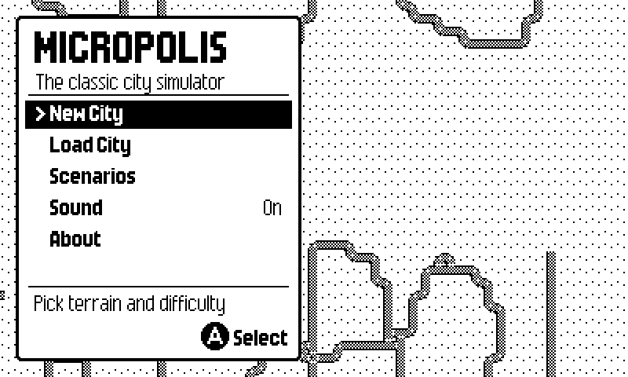 | 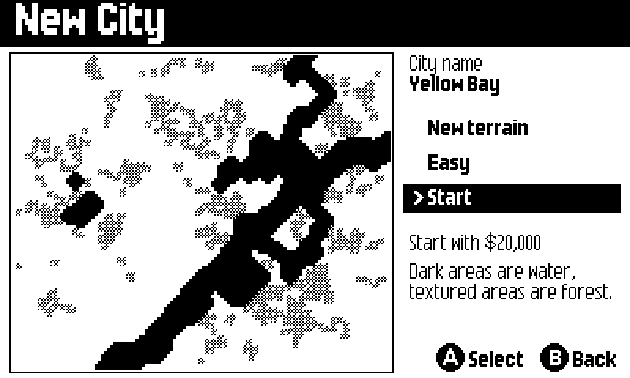 |
| **Title.** The menu drifts over a live city. | **New City.** Preview the terrain and regenerate it until you like it. |
| 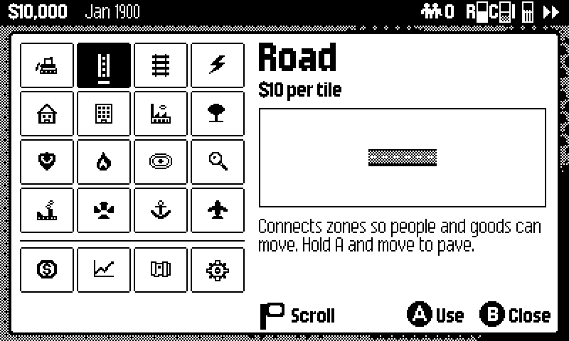 | 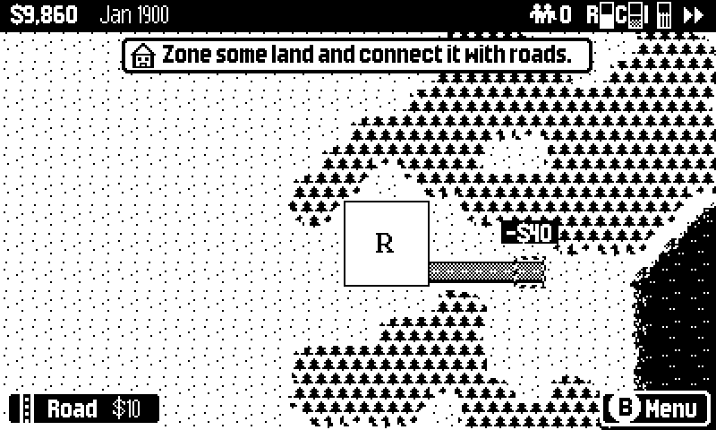 |
| **Build sheet.** All tools in a 4×4 grid, with live previews, costs and descriptions. | **Drag-building.** Hold A and move to lay road, rail or power lines. |
| 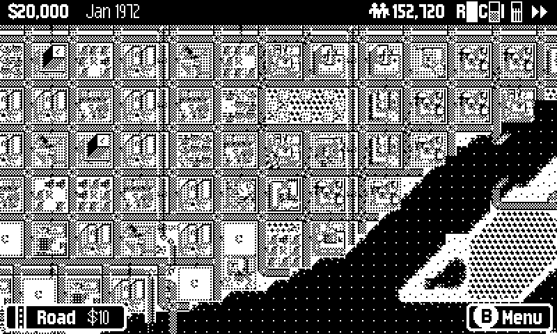 | 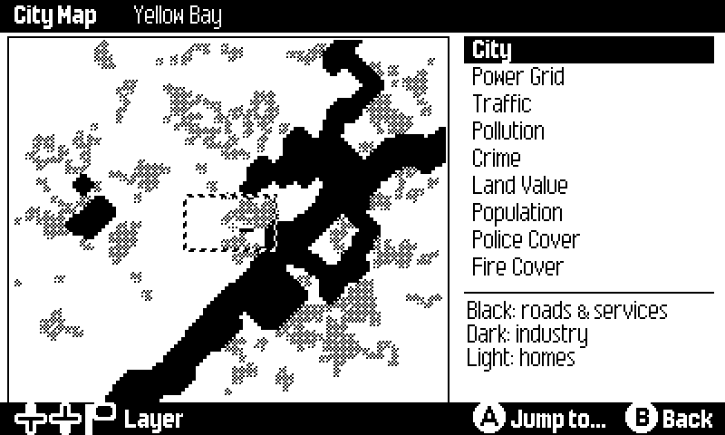 |
| **Far zoom.** Turn the crank to see more of the city. | **City Map.** Nine data layers, and you can jump anywhere. |
| 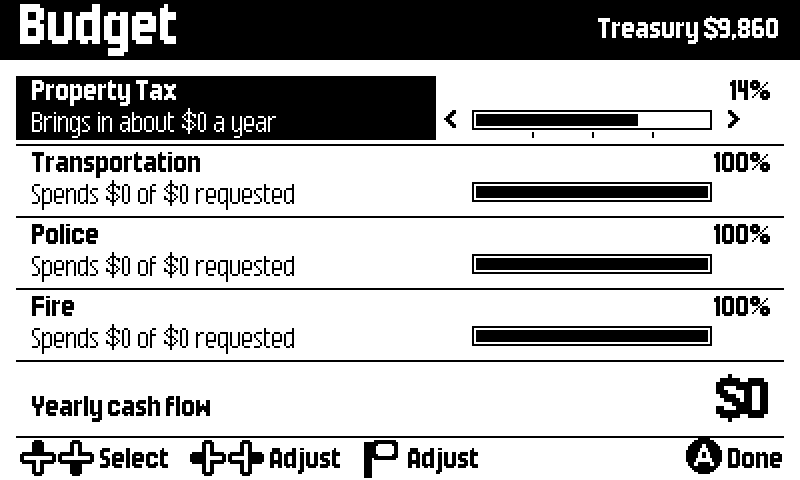 | 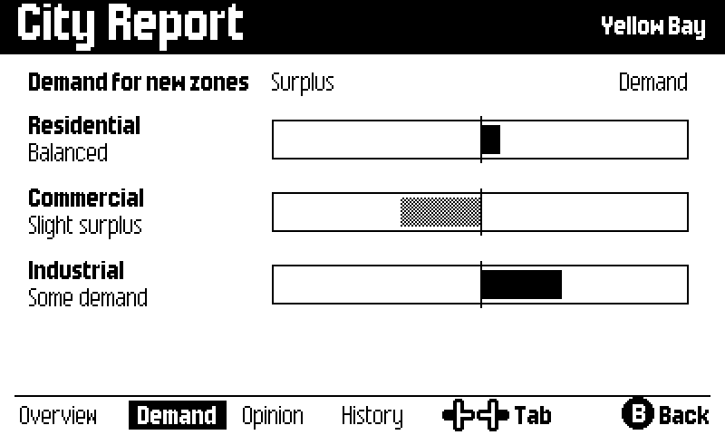 |
| **Budget.** Adjust with the D-pad or the crank. | **Demand.** What residents, shops and industry want. |
| 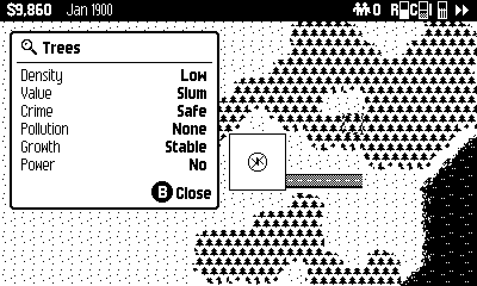 | 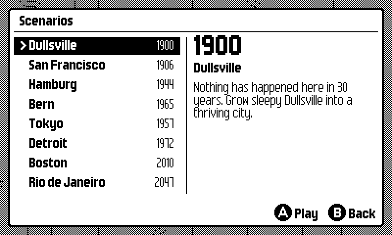 |
| **Inspect.** Check what's happening on any tile. | **Scenarios.** Eight historical challenges, from Dullsville to Rio. |

## Controls

| Input | On the map | In menus and pages |
|---|---|---|
| **D-pad** | Move the cursor (speeds up while held) | Move the selection; left and right change values |
| **Ⓐ** | Build with the current tool. Hold and move to drag-build | Select or confirm |
| **Ⓑ** | Open the build sheet | Back or close |
| **Crank** | Zoom between near and far | Scroll lists, adjust budget sliders, switch tabs and map layers |
| **Menu button** | Speed, zoom and a shortcut to the Game menu | |

## Install

Each push to `main` builds the game automatically (see [Actions](../../actions)), and tagged versions are published on the [Releases](../../releases) page.

1. Download `Micropolis.pdx.zip` from the latest release, or the build artifact of a recent workflow run.
2. Either:
   - **Sideload:** upload the zip at [play.date/account/sideload](https://play.date/account/sideload/), or
   - **USB:** connect the Playdate, put it in disk mode (*Settings → System → Reboot to Data Disk*), unzip, and copy `Micropolis.pdx` into the `Games` folder.

## Building

You need:

- the [Playdate SDK](https://play.date/dev/) (3.x), with `PLAYDATE_SDK_PATH` pointing at it,
- an ARM GCC toolchain that includes newlib: [Arm GNU Toolchain](https://developer.arm.com/downloads/-/arm-gnu-toolchain-downloads), or on Ubuntu, `gcc-arm-none-eabi` plus `libnewlib-arm-none-eabi`. Homebrew's `arm-none-eabi-gcc` formula has no C library, so it won't work.
- CMake and Python 3 with Pillow.

```bash
python3 tools/prep_assets.py
```

```bash
BUILD_DEVICE=1 cmake -S . -B build-device -DCMAKE_BUILD_TYPE=Release -DCMAKE_TOOLCHAIN_FILE=$PLAYDATE_SDK_PATH/C_API/buildsupport/arm.cmake
```

```bash
cmake --build build-device
```

This produces `micropolis_DEVICE.pdx`. `tools/prep_assets.py` generates `Source/assets` from `assets/` and from fonts that ship with the SDK, so run it again whenever art, fonts or icons change.

### Repository layout

| Path | What's there |
|---|---|
| `src/micropolis/` | The Micropolis simulation (C99 port of the original code) |
| `src/game.c`, `src/screens.c`, `src/scene_title.c` | The Playdate interface: map view, HUD, build sheet, pages, menus and title |
| `src/ui.c`, `src/map_view.c` | UI kit (text, icons, panels, hints) and the cached map renderer |
| `engine/` | A small Tiny Engine–compatible layer written directly on the Playdate C API: rendering, images, fonts, sound, scenes, input, files |
| `assets/` | Source art and sounds: the original black-and-white Micropolis tiles, sprites and sound effects |
| `tools/prep_assets.py`, `tools/art.py` | Asset pipeline, plus the pixel art for the 16px tool icons |
| `tools/harness/` | Headless screenshot harness (see below) |

### Screenshot harness

`tools/harness` builds the game against a fake Playdate API that draws into an in-memory 1-bit framebuffer. A script of button presses and crank turns drives it and saves PNG screenshots. All the screenshots in this README come from it. It currently needs macOS with Xcode.

```bash
tools/harness/run.sh tools/harness/tour.txt
```

Screenshots go to `tools/harness/out/`. Scripts are plain text: `tap a`, `hold right`, `crank 70 10`, `frames 30`, `shot name`.

## Credits

- **SimCity** was designed by Will Wright and published by Maxis in 1989.
- **Micropolis** is the GPL release of SimCity's source by Electronic Arts, made possible by Don Hopkins.
- **[vtcity](https://github.com/tenox7/vtcity)** by tenox7 is the streamlined Unix C version this port started from.
- **[tiny_micropolis](https://github.com/icedman/tiny_micropolis)** by icedman is the Tiny Engine port of the simulation, which this project builds on.
- **Fonts and button glyphs** come from the Playdate SDK by Panic: Nontendo (by Shaun Inman), plus symbols from Pedallica, Newsleak Serif and Bitmore, and the system button glyphs from Asheville Sans.
- **City art and sounds** are the original Micropolis black-and-white tiles, sprites and sound effects.

## AI disclosure

Most of the code in this fork was written by Claude, an AI model made by Anthropic, working in Claude Code. [@gopherbone](https://github.com/gopherbone) directed it: choosing the design, giving feedback on each screen, and play-testing on a real Playdate. Claude's part covers:

- the Playdate engine layer in `engine/`,
- the redesigned interface (`game.c`, `screens.c`, `scene_title.c`, `ui.c`, `map_view.c`),
- the 16px tool icons in `tools/art.py`,
- the asset pipeline, the screenshot harness and the GitHub Actions workflow,
- bug fixes to the port (stack overflow when saving, the year showing as 0, new cities starting with 0% tax and funding),
- this README.

The simulation in `src/micropolis/` is the original Micropolis code as ported by vtcity and tiny_micropolis.

## License

Micropolis is free software released under the [GNU General Public License v3](https://www.gnu.org/licenses/gpl-3.0.html), and this fork is distributed under the same terms. SimCity is a trademark of Electronic Arts. This project is not affiliated with or endorsed by Electronic Arts, Maxis or Panic.
